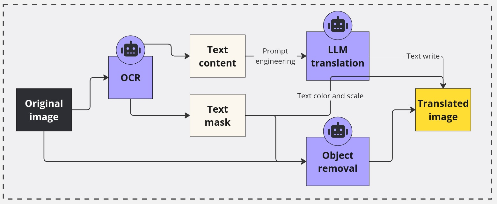
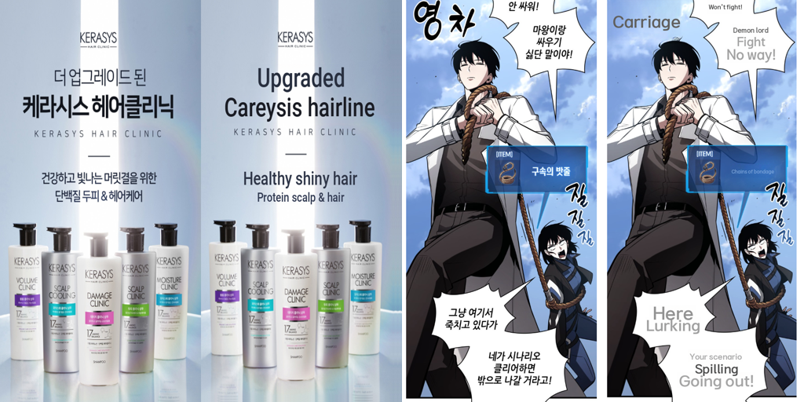
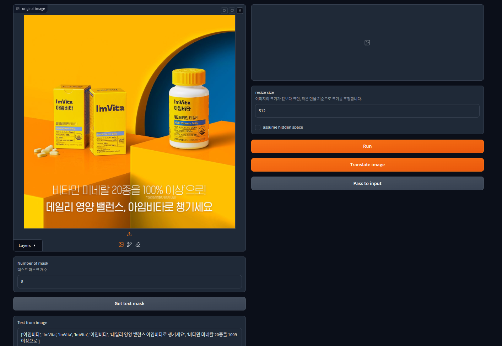
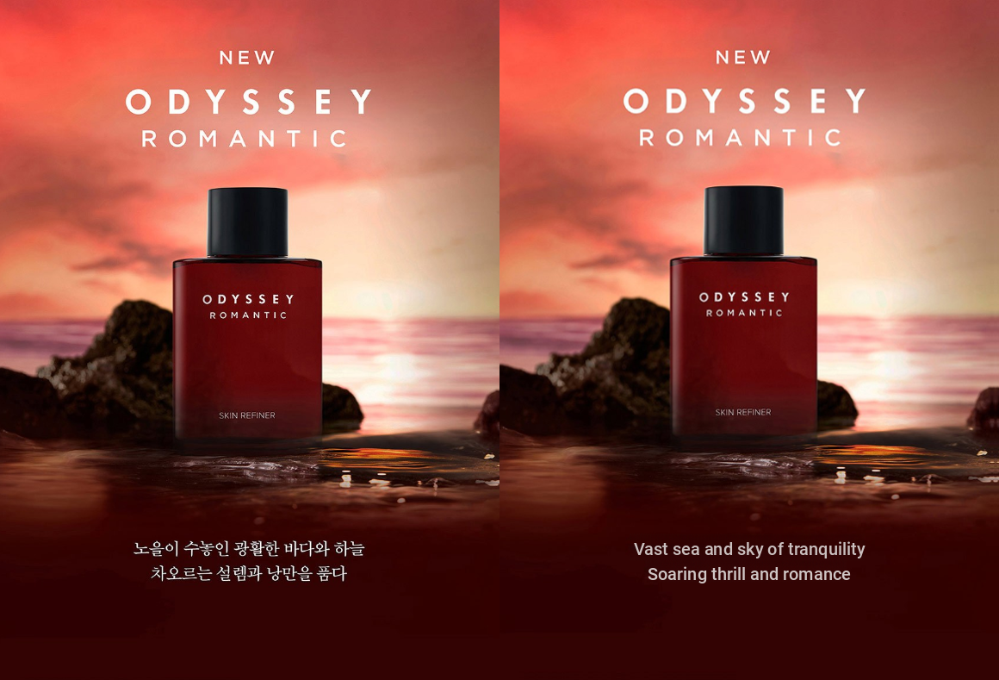
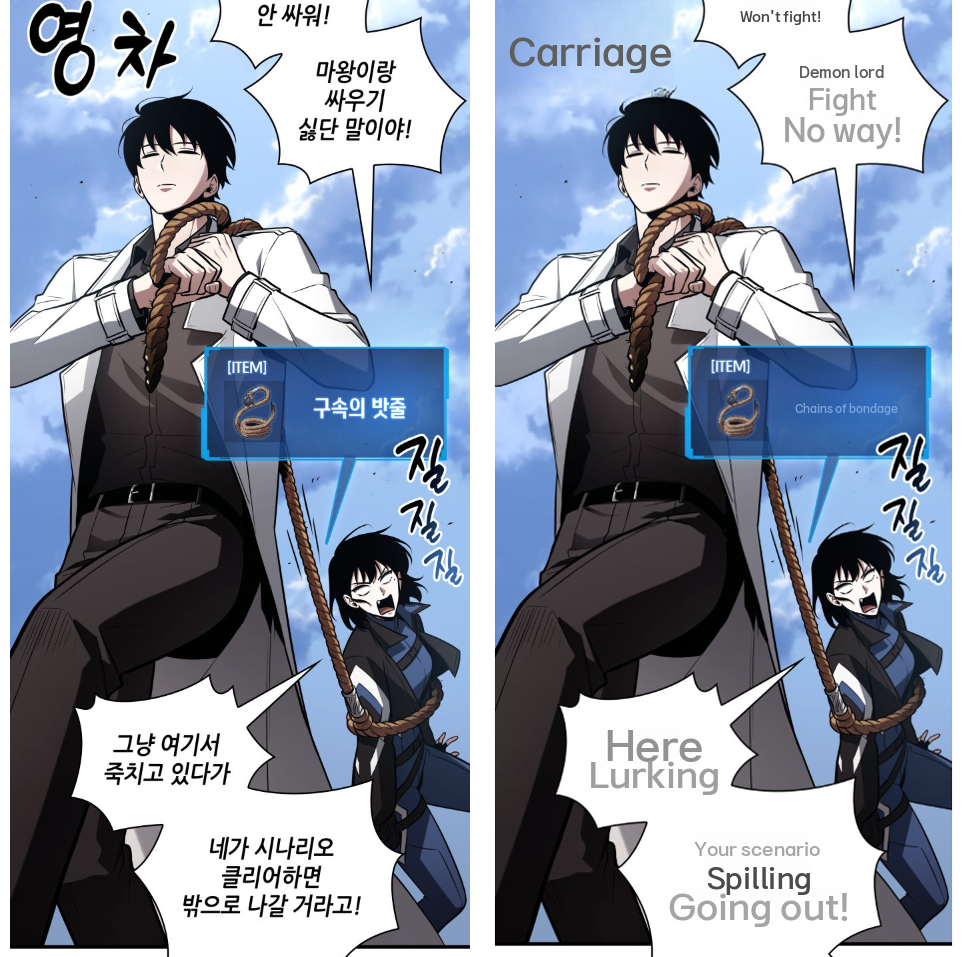
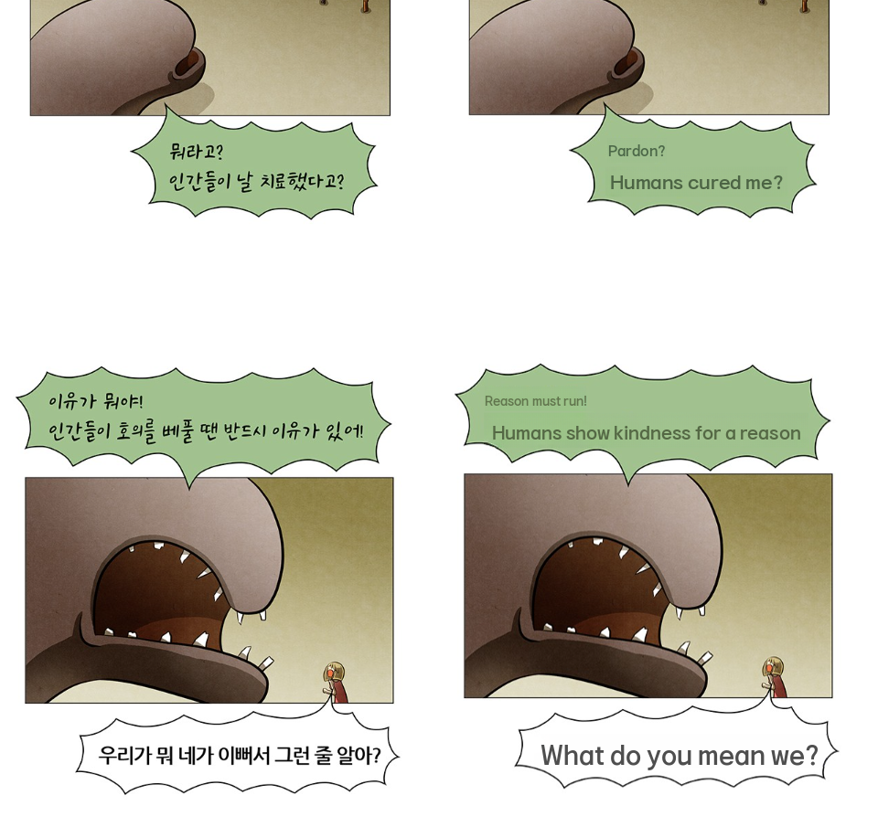

# 🎨 Image-translation: AI 기반 이미지 번역
<!--  -->
레이아웃의 일관성을 유지한 채 번역된 이미지를 만듭니다.

## 🎬 Demo


<details>
    <summary><strong>Interface</strong></summary>
    <ul>
        
    </ul>
</details>
<details>
    <summary><strong>Detail page</strong></summary>
    <ul>
        Before translate(left) / After translate(right)
        
        Before translate(left) / After translate(right)
        
        Before translate(left) / After translate(right)
        
    </ul>
</details>
<details>
    <summary><strong>Cartoon</strong></summary>
    <ul>
        This is just a temporary and insignificant result that needs a lot of improvement. The prompt provided to the LLM is not suitable, and the OCR settings are not configured to work well with comics.
        <br/><br/>
        Before translate(left) / After translate(right)
        
        Before translate(left) / After translate(right)
        
    </ul>
</details>

## 📌 Index
1. [Introduction](#-introduction)
2. [Features](#-features)
3. [Approach](#-approach)
4. [Install](#-install)
5. [How to use](#-how-to-use)
6. [Contact](#-contact)

## 🚀 Introduction
Image-Translation은 AI 기술을 활용하여 이미지 내 텍스트를 원활하고 고품질로 번역하는 새로운 접근방식을 제안합니다. 이 도구는 광학 문자 인식(OCR), 객체 제거 AI, 대규모 언어 모델(LLM)을 결합하여 현재 이미지 번역 방식의 한계를 극복하고, **원본 이미지의 레이아웃을 유지하면서 자연스러운 번역**을 제공합니다.

이 프로젝트는 이미지 현지화 접근 방식을 개선하여, 전 세계적으로 접근 가능한 콘텐츠를 더 쉽고 효율적으로 생성할 수 있게 합니다. e-commerce 제품 페이지부터 만화에 이르기까지, Image-Translation이 글로벌 콘텐츠 배포에 도움이 되길 바랍니다.

## 💡 Features
### 1. OCR 텍스트 인식
- 최신 OCR 기술을 사용하여 이미지 내 텍스트 영역을 식별합니다.
- Easy OCR(https://github.com/JaidedAI/EasyOCR)을 사용합니다. 더 적합한 OCR 모델로 교체해보세요.

### 2. AI 텍스트 객체 제거
- 객체 제거 AI를 사용하여 원본 텍스트를 깔끔하게 지우고 배경을 온전하게 유지합니다.
- LaMa(https://github.com/advimman/lama)를 사용합니다. 더 적합한 객체 제거 모델로 교체해보세요.

### 3. 텍스트 길이를 고려한 LLM 번역
- LLM을 활용하여 맥락과 텍스트 길이를 고려한 번역을 제공합니다.
- Claude(https://claude.ai)를 사용합니다.더 적합한 LLM으로 교체해보세요.

### 4. 이미지 레이아웃에 맞는 텍스트 삽입
- 원본 텍스트의 색상과 크기를 분석하고 자연스러운 결과를 이미지에 삽입합니다.

### 5. GUI 인터페이스
- Gradio 기반의 간단하고 직관적인 GUI를 제공합니다.

## 🛠 Approach

### 1. Background: Limit of image translation
현재 이미지 번역 기술은 여러 한계점을 가지고 있습니다:
- 텍스트 영역 위에 단순히 마스크를 씌우고 번역된 텍스트를 덮어씌우는 방식
- **이미지와 어울리지 않는 마스크로 인한 이미지 품질 저하**
- **원본 문장과 번역 결과 문장의 길이 차이로 인한 부자연스러운 결과**
- 폰트, 색상, 크기 등 원본 텍스트의 스타일을 유지하기 어려움

이러한 문제들로 인해 번역된 이미지의 품질과 자연스러움이 크게 저하됩니다.

### 2. Solution: 정확한 텍스트 인식 및 제거
- **OCR 기술 활용**: OCR(Optical Character Recognition) 기술을 사용하여 이미지 내의 텍스트 영역을 정확히 인식합니다.
- **객체 제거 AI 적용**: 인식된 텍스트 영역을 마스크로 사용하여 **객체 제거 AI 모델을 적용**합니다. 이를 통해 텍스트를 깔끔하게 제거하고 배경을 자연스럽게 복원합니다.

### 3. Solution: AI 번역 및 최적화
- **LLM 기반 번역**: 추출된 텍스트를 대규모 언어 모델(LLM)을 통해 번역합니다. 이 과정에서 단순 번역을 넘어 **컨텍스트를 고려한 번역**을 수행합니다.
- **Text length 최적화**: LLM에 **원본 문장과 번역 문장의 글자 길이가 최대한 비슷하도록** 추가 지시를 내립니다. 이를 통해 **레이아웃의 일관성**을 유지합니다.

### 4. Solution: 스타일 보존 및 삽입
- **스타일 분석**: 원본 텍스트 영역에서 텍스트의 주된 색상, 크기 등을 추출합니다.
- **맞춤형 텍스트 생성**: 추출된 스타일 정보에 맞춰 번역된 텍스트를 생성합니다.
- **정교한 삽입**: 생성된 텍스트를 원본 위치에 정확히 삽입하며, 필요한 경우 크기나 간격을 미세 조정하여 자연스러운 결과를 얻습니다.


## 📥 Install
```bash
# 저장소 클론
git clone {this repository}
cd Image-translation

# 가상 환경 생성 및 활성화
conda create -n image-translation python=3.10
conda activate image-translation

# 필요한 패키지 설치
pip install -r requirements.txt

# 환경 변수 설정
cp .env.example .env
# .env 파일을 열어 필요한 API 키와 설정을 입력하세요
vim .env
```

## 🖥 How to use
### Download LaMa model
```bash
cd ckpt
curl -LJO https://huggingface.co/smartywu/big-lama/resolve/main/big-lama.zip
unzip big-lama.zip
```
### `.env` configuration
| name | description |
|--------|------|
| ANTHROPIC_API_KEY | Anthropic API key |
| SRC_LANG | 번역 대상 이미지의 언어(ko or en) / en 선택시 한국어로 번역, ko 선택시 영어로 번역|
| FONT_PATH | 사용할 폰트의 경로, 폰트가 번역 목표 언어를 지원해야 함 |
| OCR_MODEL_PATH | OCR 모델의 경로 |
| LAMA_MODEL_PATH | LaMa(객체 제거 AI) 모델의 경로 |

```
ANTHROPIC_API_KEY=YOUR_ANTHROPIC_API
SRC_LANG=ko
FONT_PATH=./font/KBO Dia Gothic_medium.ttf 
OCR_MODEL_PATH=./ckpt
LAMA_MODEL_PATH=./ckpt/big-lama.pt
```
### Run GUI
1. GUI app 실행
    ```bash
    python3 app.py
    ```
2. Translate to image 버튼 클릭

## 📚 Reference

This project is based on research and code from several papers and open-source repositories.

- Easy_OCR: https://github.com/JaidedAI/EasyOCR
- LaMa: Resolution-robust Large Mask Inpainting with Fourier Convolutions: https://github.com/advimman/lama

## 📞 Contact
middlek - middlekcenter@gmail.com

<!-- favorfit - lab@favorfit.ai -->